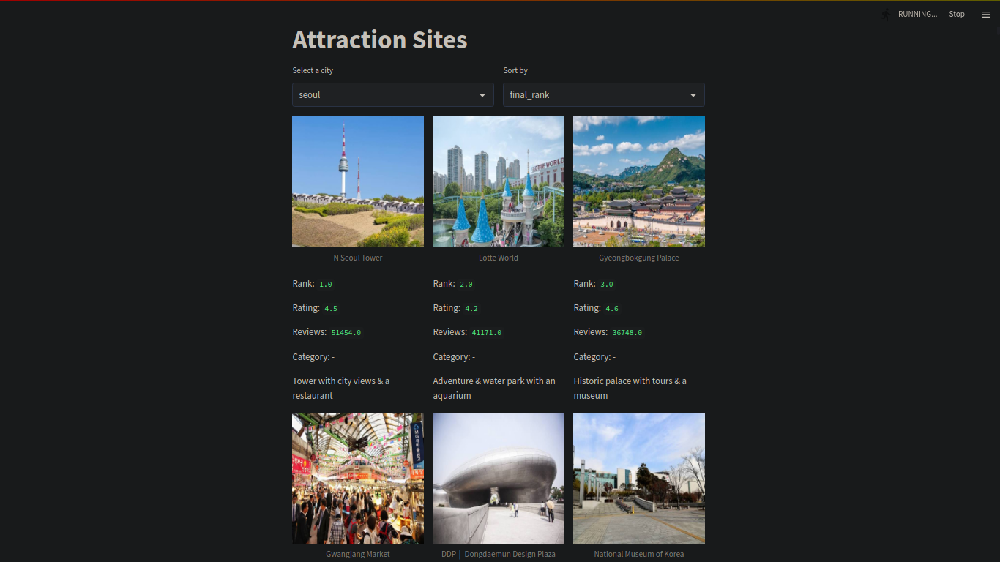
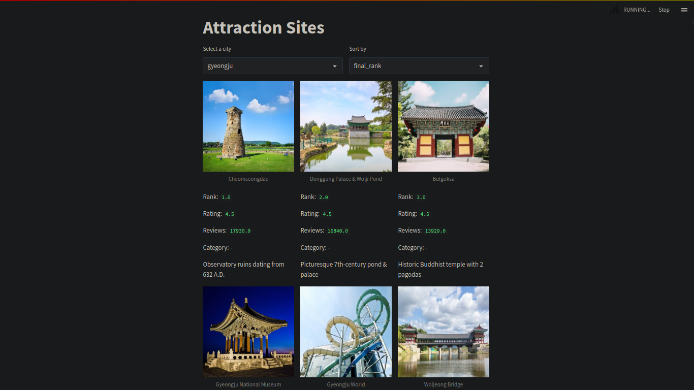

# Google-Traveler

### How to use the repo
1. Clone the repo and run `make venv`
2. Run `source traveler/bin/activate` to activate the environment.
2. Run `python3 ./main.py` to download the data
3. Run `streamlit run ./app.py` to start the webapp on localhost.

### Screenshot of the data downloaded using main.py

### Screenshot of the app
###### a) Soeul

###### b) Hong Kong

###### c) Gyeongju
