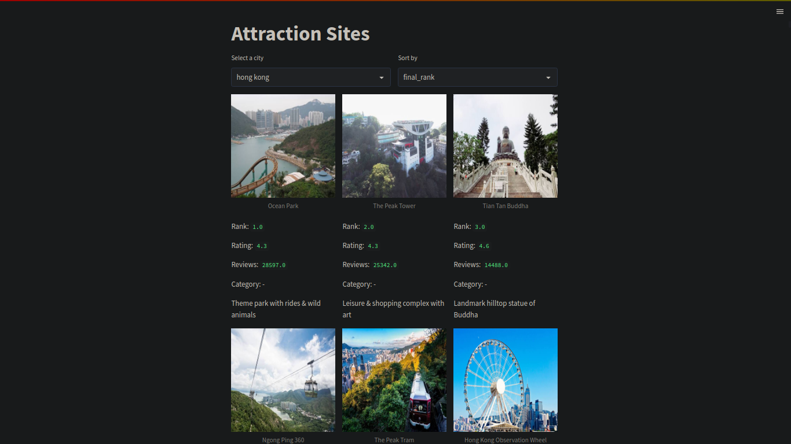

# Google-Traveler
 Objective - Generate ranking of tourist attractions based on both rating and reviews.

### How to use the repo
First, clone the repo and run `make venv`. Following which

1. Open Google travel and select "Things to do".
2. Make a search of the city you want to scrap data for.
3. Scroll a little and click "See all top sights"
4. Copy url in the list of urls in `main.py`
5. Run `source traveler/bin/activate` to activate the environment.
6. Run `python3 ./main.py` to download the data
7. Run `streamlit run ./app.py` to start the webapp on localhost.

### Screenshot of the data downloaded using main.py

### Screenshot of the app
###### a) Soeul

###### b) Hong Kong

###### c) Gyeongju
